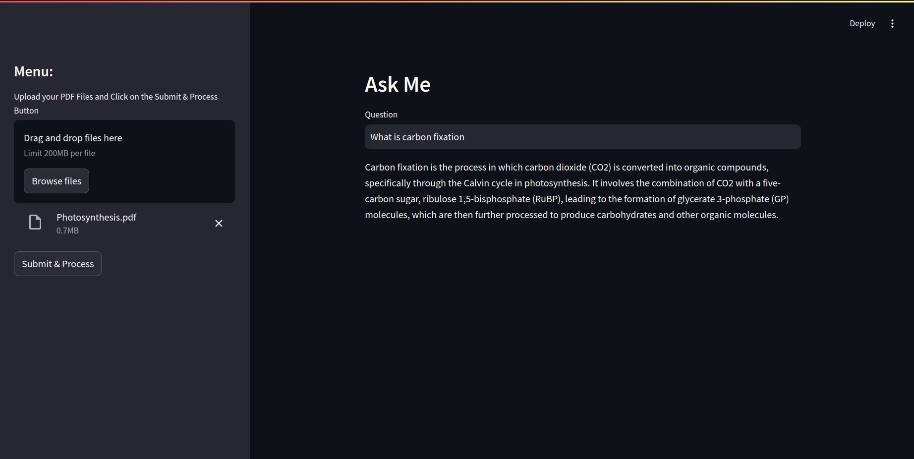

# RAG Application with Streamlit, Langchain, and Qdrant

## Overview

This project is a Retrieval-Augmented Generation (RAG) application that allows users to upload PDF documents, which are then processed, chunked, embedded, and stored in a Qdrant vector database. Users can ask questions related to the content of the PDFs, and the application retrieves relevant information to generate accurate answers.

## Features

- Upload PDF files for processing.
- Chunk PDF content into segments.
- Embed chunks using Langchain.
- Store embeddings in Qdrant for efficient retrieval.
- Answer user questions based on embedded chunks.

## Technologies Used

- **Streamlit**: For creating the user interface.
- **Langchain**: For embedding text chunks and chat completion.
- **Qdrant**: For vector storage and retrieval.
- **Python**: The primary programming language.

## Example


## Installation

1. **Clone the repository:**

   ```
   git clone https://github.com/amolambkar/AskMe
   cd AskMe
   ```

2. **Create a virtual environment:**

   ```
   python -m venv venv
   source venv/bin/activate
   ```

3. **Install the required packages:**

   ```
   pip install -r requirements.txt
   ```


4. **Create .env using .env.sample:**

   ```
   add required cred to .env
   ```

5. **Run the Streamlit app:**

   ```
   streamlit run app.py
   ```

## WorkFlow

    +-----------------------------------------+
    |              User                      |
    +-----------------------------------------+
                      |
                      | Upload PDF
                      v
    +---------------------+                  
    |   User Interface    |                  
    |      (Streamlit)    |                  
    +----------+----------+
               |
               | Process PDF
               v
    +---------------------+
    |   PDF Chunking      |
    |   (process.py)|
    +----------+----------+
               |
               | Generate Chunks
               v
    +---------------------+
    |   Embedding Module   |
    |   (embed.py)     |
    +----------+----------+
               |
               | Store Embeddings
               v
    +---------------------+
    |   Qdrant Vector DB  |
    +----------+----------+
               |
               | Query for Relevant Chunks
               v
    +---------------------+
    |   QA System         |
    |   (qa.py)    |
    +----------+----------+
               |
               | Generate Answer
               v
    +---------------------+
    |   User Interface    |
    |      (Streamlit)    |
    +----------+----------+
                      |
                      | Display Answer
                      v
    +-----------------------------------------+
    |              User                      |
    +-----------------------------------------+


